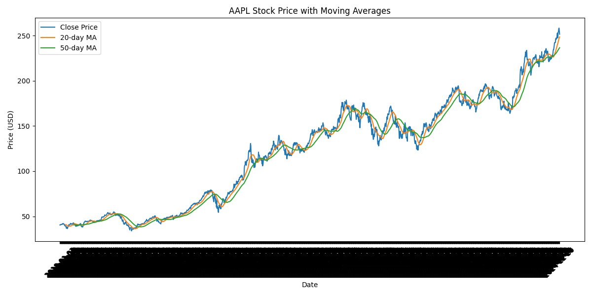
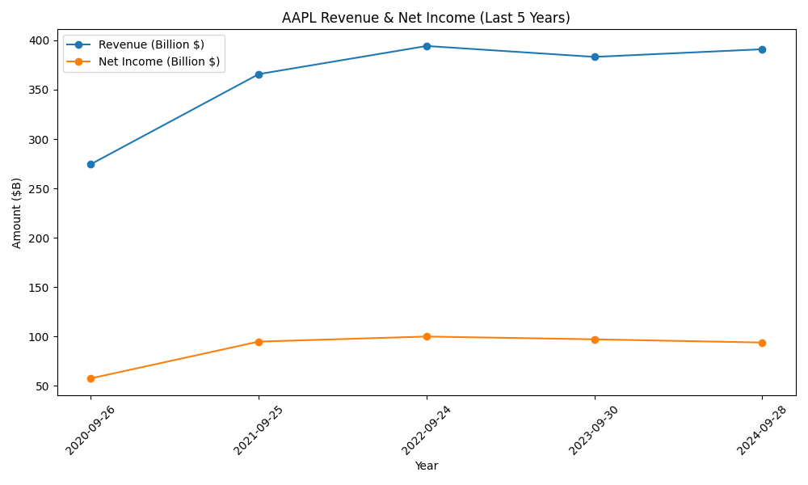

# 🧠 Hedge Fund Equity Analysis – AAPL

This project simulates the daily work of a hedge fund analyst, applied to Apple Inc. (AAPL).  
It uses Python and real financial APIs to pull data, run a simplified DCF model, and visualize key financial trends.

---

## 🔍 Features

- ✅ Downloads historical stock prices via `yfinance`
- ✅ Pulls income & balance sheet data from Financial Modeling Prep API
- ✅ Calculates fair value using a basic Discounted Cash Flow (DCF) model
- ✅ Plots revenue, net income, and price with moving averages
- ✅ Stores all outputs locally for review

---

## 📈 Sample Output

**Price & Moving Averages**



**Revenue & Net Income Trend**



---

## 🧰 Tools Used

- Python 3.9
- pandas
- matplotlib
- yfinance
- Financial Modeling Prep API
- SQLite (optional for storage)
- Git/GitHub for version control

---

## 🚀 How to Run Locally

1. Clone the repo:
   ```bash
   git clone https://github.com/YOUR_USERNAME/hedge_fund_equity_analysis.git
   cd hedge_fund_equity_analysis
